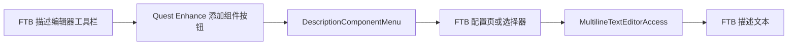

# 1.21.1 任务描述快捷组件 - 设计文档

> 目标：把 1.20.1 已验证的任务描述快捷组件迁移到 1.21.1 NeoForge，并保持 FTB Quests 原生编辑能力不重复。
> 范围：快捷组件菜单、选中文字转换、视频入口整合、中英文文本、2.0 发布准备。**不包含**新增任务数据格式、自动操控游戏测试或迁移回 1.20.1。
> 约束：Minecraft 1.21.1、NeoForge 21.1.233、Java 21、FTB Quests 2101.1.27、FTB Library 2101.1.31。

## 1. 背景与问题

1.20.1 已有统一的“添加组件”菜单，但 1.21.1 仍把视频作为独立工具栏按钮，缺少网络链接、复制、物品悬停、自定义字体等快捷配置。直接复制代码会混用版本 API，尤其是物品选择界面包路径、文字组件序列化和图片组件字段访问已经变化。

## 2. 方案与原则

在 FTB 原生工具栏后只增加一个“添加组件”按钮。FTB 已有的任务跳转、本地图片、分页符和 JSON 转换继续使用原生按钮；新增菜单仅提供原生工具栏未直接提供的能力。

菜单范围冻结为：

- 导航与交互：网页链接、跳转到任务指定页、点击复制、开发者命令。
- 媒体与物品：网络图片、物品图标、物品悬停、视频。
- 文字组件：悬停文字、自定义字体、本地化文本、按键绑定、混淆文字。

## 3. 架构与关键决策



- `DescriptionComponentMenu` 负责菜单、配置页、组件构造和视频选择入口。
- `MultilineTextEditorAccess` 只暴露插入与选择区能力，不保存业务状态。
- `MultilineTextEditorScreenMixin` 使用 1.21.1 的 `Component.Serializer.toJson(component, FTBQuestsClient.holderLookup())` 生成 JSON，不能继续使用 1.20.1 的单参数写法。
- `MultilineTextEditorToolbarMixin` 删除独立视频按钮，改为单一组件按钮；不复制 FTB 原生图片、任务跳转和分页符。
- 不新增任务文件字段；生成内容仍是 FTB 图片标记、原版文字组件 JSON 或现有视频标记。

## 4. 依赖

- **硬依赖**：FTB Quests 2101.1.27、FTB Library 2101.1.31、现有视频选择与播放代码、现有章节字体枚举。
- **软依赖**：网络图片需要客户端网络可访问 URL；任务书本身不承担下载缓存保证。

## 5. 接口与约定

`MultilineTextEditorAccess` 冻结为以下逻辑接口：

```java
// 描述编辑器只向快捷组件暴露必要的插入与选择区能力
void quest_enhance$insert_at_end_of_line(String text);
boolean quest_enhance$has_single_line_selection();
String quest_enhance$get_selected_text();
void quest_enhance$insert_component(Component component);
```

- 新类位置：`com.quest_enhance.client.DescriptionComponentMenu`。
- 语言键前缀：`quest_enhance.description_component.`。
- 单行选择内容可转换为组件；跨行选择或已是 JSON 的整行改为追加新行，避免损坏描述。
- 右键编辑独立 JSON 组件时，识别到快捷组件类型就恢复对应配置 UI；普通文字、复杂组件数组和未知 JSON 回退 FTB 原始编辑器。
- 开发者命令保留明确确认提示；不加入 `open_file`、`suggest_command`、实体悬停、选择器、计分板或 NBT 组件。
- 1.21.1 物品选择器使用 `dev.ftb.mods.ftblibrary.config.ui.resource.SelectItemStackScreen`。

## 6. 风险与边界

| 风险 | 等级 | 处理 |
|---|---|---|
| 文字 JSON 序列化签名变化 | 高 | 使用已验证的 `Component.Serializer.toJson` 与 holder lookup |
| Mixin 内部类字段或工具栏坐标变化 | 中 | 对照当前依赖反编译源码，并以 `compileJava` 验证注入签名 |
| 物品数据组件导致任务文本膨胀 | 中 | 物品图标只保存物品类型；物品悬停才复制完整选中物品 |
| 网络图片不可用或加载缓慢 | 中 | 仅接受 HTTP/HTTPS，失败保持 FTB 原生占位行为 |
| 命令组件被滥用 | 高 | 保留二次确认，不提供文件打开或命令建议能力 |

**边界**：本阶段不增加新的 1.21.1 独占任务格式，不自动启动或控制 Minecraft，不改变现有视频播放存储协议。

## 7. 验证状态

| 项目 | 状态 | 来源或确认方式 |
|---|---|---|
| 当前项目为 Minecraft 1.21.1 NeoForge | 已确认 | `gradle.properties` 与依赖配置 |
| FTB 原生已有分页符、本地图片、任务跳转、JSON 转换 | 已确认 | FTB Quests 2101.1.27 `MultilineTextEditorScreen` |
| FTB 图片标记支持 URL、尺寸、对齐、fit 和悬停文字 | 已确认 | FTB Library 2101.1.31 `ClientTextComponentUtils` 与 `ImageComponent` |
| 物品选择器包路径迁移到 `config.ui.resource` | 已确认 | FTB Library 2101.1.31 `ItemStackConfig` |
| 1.21.1 组件序列化需要注册表上下文 | 已确认 | 当前映射 `Component.Serializer.toJson(Component, HolderLookup.Provider)` 与 `FTBQuestsClient.holderLookup()` |
| 当前视频标记可继续由同一配置页生成 | 已确认 | 项目 `QuestDescriptionVideo` 与 `DescriptionVideoConfigScreen` |
| 全部 13 项快捷组件在 1.21.1 均能编译 | 已确认 | `compileJava` 成功 |
| 中英文语言文件 JSON 有效 | 已确认 | PowerShell JSON 解析与 `processResources` 成功 |
| 发行 JAR 内容与版本为 `1.21.1-neoforge-2.0` | 已确认 | `build` 成功并检查 JAR 内 `neoforge.mods.toml` 与类文件 |
| 右键编辑可识别组件时使用配置 UI | 已确认 | `editDescLine0` 注入与 `DescriptionComponentMenu.edit` 通过 `compileJava` |

## 8. 待定问题

- 全部 13 项已经实现；剩余事项是由用户手动确认游戏内布局、菜单返回路径和实际点击效果。
- “跳转到任务指定页”使用 FTB 原生任务选择器，并按目标任务当前实际描述页数限制页码。
- “混淆文字”使用原版 `ChatFormatting.OBFUSCATED` 组件样式，不依赖手写格式字符串。
- 不建议增加 `open_file`、`suggest_command`、实体悬停、selector、score 或 NBT：分别存在本机路径安全、任务页无输入目标、普通模式不可见或需要服务端解析等问题。

## 修订记录

- 2026-07-17：基于 1.21.1 实际 FTB Quests/Library 依赖完成初版设计与 API 核对。
- 2026-07-17：完成 13 项组件、统一工具栏入口、2.0 版本和构建验证。
- 2026-07-17：增加右键编辑独立快捷 JSON 时恢复对应配置 UI，并保留未知内容回退。
