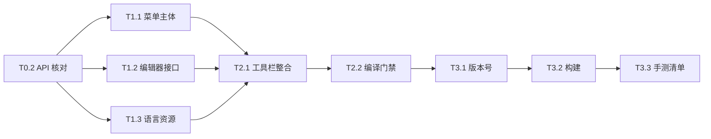

# 1.21.1 任务描述快捷组件 - 总任务表

> 来源：[设计文档](1211-description-components-design.md)。范围：将 1.20.1 快捷组件安全迁移至 1.21.1 NeoForge，并准备 2.0。
> 状态：todo / in-progress / done / blocked。复杂度：S / M / L。不提供时间估算。

## 里程碑

| 里程碑 | 可验证交付物 | 阶段 |
|---|---|---|
| M0 | 1.20.1 2.0 已发布，1.21.1 API 差异已冻结 | 阶段 0 |
| M1 | 1.21.1 快捷组件代码与语言资源完成 | 阶段 1-2 |
| M2 | 1.21.1 2.0 构建通过并交由用户手测 | 阶段 3 |
| M3 | 1.21.1 独有的指定页跳转与混淆文字完成 | 阶段 4 |

## 阶段 0：发布与核对 -> M0

| ID | 任务 | Cx | 依赖 | 验收标准 | 文件 |
|---|---|---|---|---|---|
| done T0.1 | 推送 1.20.1 Forge 2.0 | S | - | 远端分支包含提交 `1889ea5` | 1.20.1 工作树 |
| done T0.2 | 核对 1.21.1 FTB 与 Minecraft API | M | - | 设计文档第 7 节列出的关键 API 均有实际源码依据 | `docs/1211-description-components-design.md` |

## 阶段 1：冻结接口与菜单主体 -> M1

| ID | 任务 | Cx | 依赖 | 验收标准 | 文件 |
|---|---|---|---|---|---|
| done T1.1 | 增加快捷组件菜单主体 | L | T0.2 | 菜单包含全部 13 项能力，且使用 1.21.1 包路径 | `src/main/java/com/quest_enhance/client/DescriptionComponentMenu.java` |
| done T1.2 | 扩展编辑器访问接口与选区插入 | M | T0.2 | 单行选区被安全替换，跨行与 JSON 行不损坏，序列化使用当前注册表上下文 | `MultilineTextEditorAccess.java`、`MultilineTextEditorScreenMixin.java` |
| done T1.3 | 增加中英文语言键 | S | T0.2 | 两个 JSON 文件包含相同键集合且资源处理成功 | `zh_cn.json`、`en_us.json` |

## 阶段 2：工具栏整合 -> M1

| ID | 任务 | Cx | 依赖 | 验收标准 | 文件 |
|---|---|---|---|---|---|
| done T2.1 | 用单一组件按钮替换独立视频按钮 | M | T1.1、T1.2、T1.3 | 视频仅在组件菜单出现，原生图片/分页/任务跳转仍保留 | `MultilineTextEditorToolbarMixin.java` |
| done T2.2 | 编译集成门禁 | S | T2.1 | `compileJava` 与 `processResources` 成功 | 构建输出 |

## 阶段 3：2.0 发布准备 -> M2

| ID | 任务 | Cx | 依赖 | 验收标准 | 文件 |
|---|---|---|---|---|---|
| done T3.1 | 将 1.21.1 版本改为 `1.21.1-neoforge-2.0` | S | T2.2 | 资源处理后的模组元数据版本正确 | `gradle.properties` |
| done T3.2 | 完整构建和产物核对 | M | T3.1 | `build` 成功，JAR 名称和元数据均为 2.0 | `build/libs` |
| done T3.3 | 提供手动测试清单 | S | T3.2 | 覆盖 13 个组件、选区替换、视频入口和原生按钮回归 | 本任务表执行记录 |

## 阶段 4：候选增强 -> M3

| ID | 任务 | Cx | 依赖 | 验收标准 | 文件 |
|---|---|---|---|---|---|
| done T4.1 | 实现“跳转到任务指定页” | M | T3.3 | 使用 FTB 任务选择器与 `任务ID/页码` 格式 | `DescriptionComponentMenu.java` |
| done T4.2 | 实现“混淆文字” | S | T3.3 | 使用原版混淆样式生成组件 | `DescriptionComponentMenu.java` |

## 依赖图

关键路径：T0.2 -> T1.1/T1.2/T1.3 -> T2.1 -> T2.2 -> T3.1 -> T3.2 -> T3.3 -> T4.1/T4.2，现已全部完成。

## 阻塞研究

当前没有未解决的 API 阻塞项。运行时布局与交互仍需要用户手动测试，不作为源码迁移前置阻塞。

## 风险登记

| 风险 | 等级 | 缓解措施 | 相关任务 |
|---|---|---|---|
| 组件序列化未传 holder lookup | 高 | 使用已确认的双参数 `Component.Serializer.toJson` | T1.2、T2.2 |
| 工具栏坐标覆盖原生按钮 | 中 | 仅增加一个 16x16 按钮并在编译后交由用户手测 | T2.1、T3.3 |
| 组件语言键缺失 | 中 | 中英文同阶段补齐并运行资源处理 | T1.3、T2.2 |
| GitHub 网络不稳定 | 中 | 保留本地提交并重试，不改写历史 | T0.1 |

## 完成定义

- done 1.20.1 的 2.0 提交在远端可见。
- done 1.21.1 的快捷菜单不重复 FTB 原生功能。
- done `compileJava`、`processResources`、`build` 全部通过。
- done 1.21.1 JAR 与元数据版本均为 `1.21.1-neoforge-2.0`。
- done 提供明确的用户手动测试项目，不使用电脑操控或游戏自动化。

## 手动测试清单

- 打开任务描述编辑器，确认工具栏只有一个 Quest Enhance `+` 按钮，独立视频按钮已删除。
- 依次插入网页链接、任务指定页、复制、开发者命令、网络图片、物品图标、物品悬停、视频、悬停文字、自定义字体、本地化文本、按键绑定和混淆文字。
- 选中普通单行文字后插入组件，确认行首和行尾文字保留；跨行选择和 JSON 行确认不会损坏原描述。
- 指定页跳转选择多页任务，分别测试第一页与末页；开发者命令确认仍显示二次确认。
- 回归 FTB 原生任务跳转、本地图片、分页符、JSON 转换和撤销按钮。
- 右键编辑十类独立 JSON 组件，确认打开对应配置 UI；普通文字、复杂 JSON 数组和未知 JSON 仍打开原版字符串编辑器。
